               # Project 4: Kalman Filters
Written By Malcolm Benedict
## Instructions
1) Clone this repository into a directory of your choosing
2) In the root of the directory build and source the workspace with the following:

        $ colcon build
        $ source install/setup.bash   
3) Run the following command to start the turtlebot node:

        $ ros2 run kalman_filter turtlebot_filter
4) Open a new terminal window, navigate to the root of the workspace and source the terminal per step 2. 
5) In this new window, run the following code to launch the tutorial frame transformer:

        $ ros2 run ros2 run kalman_filter static_tf2_broadcaster odom 0 0 0 0 0 0 
6) Open a new terminal window, navigate to the root of the workspace and source the terminal per step 2.
7) Run the following in the new terminal to open rviz:

        $ rviz2
8) Open a new terminal window, navigate to the root of the workspace and source the terminal per step 2.
9) In this final terminal, run the following to play the ros bag:
        $ ros2 bag play rosbag2_2026_02_02-14_33_55/
10)  You should be able to visualize the paths in Rviz by adding their topics. If you are unsure how to do this, please consult the ROS documentation on Rviz. Additionally, state data will be output to CSV files located in the 'data' folder. These can be used to generate graphs in a program such as Libre Office or Microsoft Excel. Each row of these files represents a timestamp.

## Results 

### Kalman Filter

The results of the pure Kalman filter are shown below. Note that the state and observation transition matrices are the following:
$$
$$

                          [[1,dt,0,0,0,0,0,0,0],
                           [0,0.5,dt,0,0,0,0,0,0],
                           [0,0,1,0,0,0,0,0,0],
                           [0,0,0,1,dt,0,0,0,0],
        F      =           [0,0,0,0,0.5,dt,0,0,0],
                           [0,0,0,0,0,1,0,0,0],
                           [0,0,0,0,0,0,1,dt,0],
                           [0,0,0,0,0,0,0,0.5,dt],
                           [0,0,0,0,0,0,0,0,1]]

                          [[0,0,0,0,0,0,0,0,0],
                           [0,0,0,0,0,0,0,0,0],
                           [0,0,1,0,0,0,0,0,0],
                           [0,0,0,0,0,0,0,0,0],
        H     =            [0,0,0,0,0,0,0,0,0],
                           [0,0,0,0,0,1,0,0,0],
                           [0,0,0,0,0,0,1,0,0],
                           [0,0,0,0,0,0,0,1,0],
                           [0,0,0,0,0,0,0,0,0]]

                          [[0,0,0,0,0,0,0,0,0],
                           [0,0.5,0,0,0,0,0,0,0],
                           [0,0,0,0,0,0,0,0,0],
                           [0,0,0,0,0,0,0,0,0],
        B     =            [0,0,0,0,0.5,0,0,0,0],
                           [0,0,0,0,0,0,0,0,0],
                           [0,0,0,0,0,0,0,0,0],
                           [0,0,0,0,0,0,0,0.5,0],
                           [0,0,0,0,0,0,0,0,0]]
$$
$$
Where dt is the fundamental timestep, 0.05s.

The state estimate is shown below:
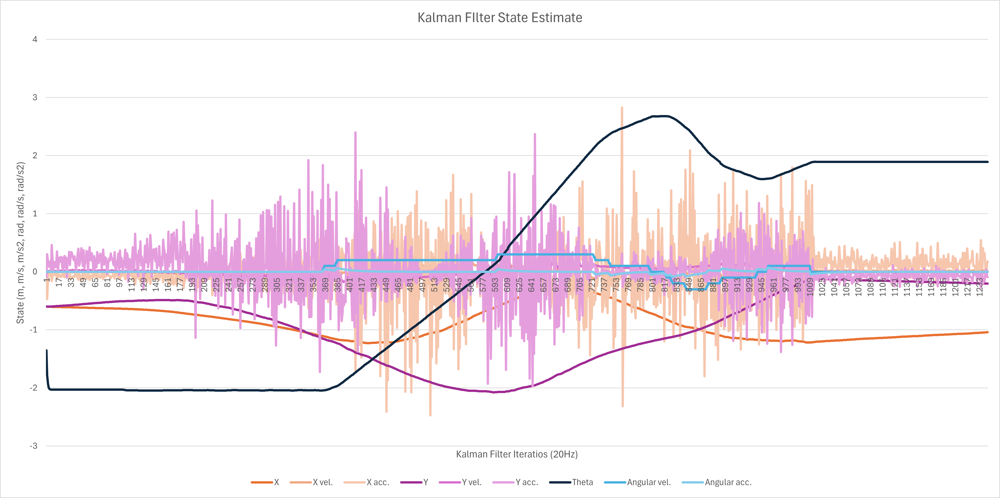

The sensed vector z is shown below:
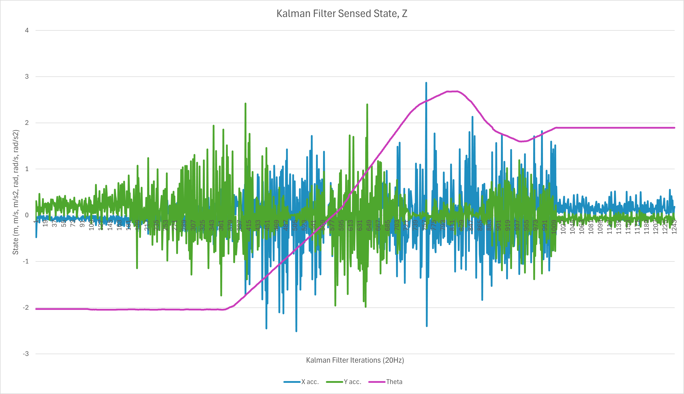

### Extended Kalman Filter

The results of the Extended Kalman filter are shown below. Note that the state and observation transition matrices are the following:
$$
$$

                          [[1,dt,0,0,0,0,0,0,0],
                           [0,0.5,dt,0,0,0,0,0,0],
                           [0,0,1,0,0,0,0,0,0],
                           [0,0,0,1,dt,0,0,0,0],
        F      =           [0,0,0,0,0.5,dt,0,0,0],
                           [0,0,0,0,0,1,0,0,0],
                           [0,0,0,0,0,0,1,dt,0],
                           [0,0,0,0,0,0,0,0.5,dt],
                           [0,0,0,0,0,0,0,0,1]]

                          [[0,0,0,0,0,0,0,0,0],
                           [0,0,0,0,0,0,0,0,0],
                           [0,0,m.cos(theta),0,0,sin(theta),0,-(x_acc*sin(theta)) + (y_acc*cos(theta)),0],
                           [0,0,0,0,0,0,0,0,0],
        H     =            [0,0,0,0,0,0,0,0,0],
                           [0,0,-sin(theta),0,0,cos(theta),0,-(x_acc*cos(theta))-(y_acc*sin(theta)),0],
                           [0,0,0,0,0,0,1,0,0],
                           [0,0,0,0,0,0,0,1,0],
                           [0,0,0,0,0,0,0,0,0]]

                          [[0,0,0,0,0,0,0,0,0],
                           [0,0.5,0,0,0,0,0,0,0],
                           [0,0,0,0,0,0,0,0,0],
                           [0,0,0,0,0,0,0,0,0],
        B     =            [0,0,0,0,0.5,0,0,0,0],
                           [0,0,0,0,0,0,0,0,0],
                           [0,0,0,0,0,0,0,0,0],
                           [0,0,0,0,0,0,0,0.5,0],
                           [0,0,0,0,0,0,0,0,0]]
$$
$$
Where dt is the fundamental timestep, 0.05s. Theta is taken at every step, and can be found in the graph below:

The state estimate is shown below:
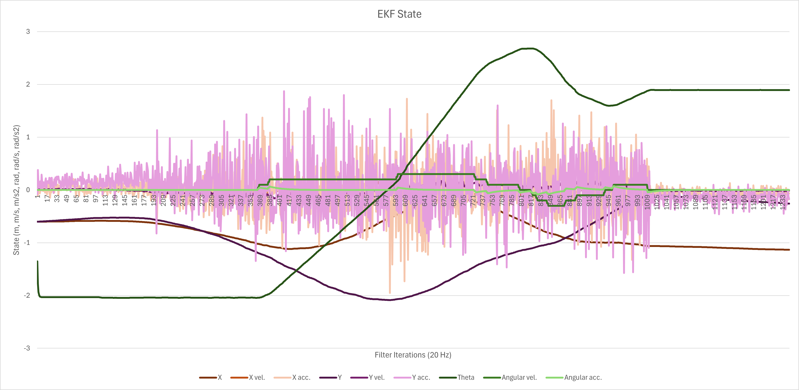

The sensed vector z is shown below:
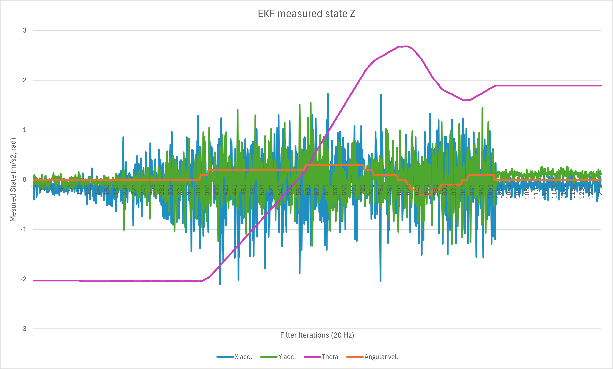

### Unscented Kalman Filter

The results of the Unscented Kalman filter are shown below. Note that the state and observation transition matrices are the following:
$$
$$

                          [[1,dt,0,0,0,0,0,0,0],
                           [0,0.5,dt,0,0,0,0,0,0],
                           [0,0,1,0,0,0,0,0,0],
                           [0,0,0,1,dt,0,0,0,0],
        F      =           [0,0,0,0,0.5,dt,0,0,0],
                           [0,0,0,0,0,1,0,0,0],
                           [0,0,0,0,0,0,1,dt,0],
                           [0,0,0,0,0,0,0,0.5,dt],
                           [0,0,0,0,0,0,0,0,1]]

                          [[0,0,0,0,0,0,0,0,0],
                           [0,0,0,0,0,0,0,0,0],
                           [0,0,m.cos(theta),0,0,sin(theta),0,-(x_acc*sin(theta)) + (y_acc*cos(theta)),0],
                           [0,0,0,0,0,0,0,0,0],
        H     =            [0,0,0,0,0,0,0,0,0],
                           [0,0,-sin(theta),0,0,cos(theta),0,-(x_acc*cos(theta))-(y_acc*sin(theta)),0],
                           [0,0,0,0,0,0,1,0,0],
                           [0,0,0,0,0,0,0,1,0],
                           [0,0,0,0,0,0,0,0,0]]

                          [[0,0,0,0,0,0,0,0,0],
                           [0,0.5,0,0,0,0,0,0,0],
                           [0,0,0,0,0,0,0,0,0],
                           [0,0,0,0,0,0,0,0,0],
        B     =            [0,0,0,0,0.5,0,0,0,0],
                           [0,0,0,0,0,0,0,0,0],
                           [0,0,0,0,0,0,0,0,0],
                           [0,0,0,0,0,0,0,0.5,0],
                           [0,0,0,0,0,0,0,0,0]]
$$
$$
Where dt is the fundamental timestep, 0.05s. Theta is taken at every step, and can be found in the graph below:

The state estimate is shown below:
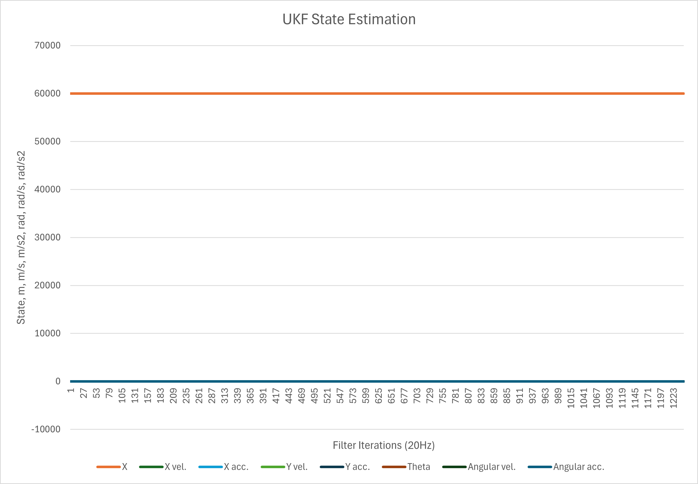
This atypical result will be discussed later

The sensed vector z is shown below:
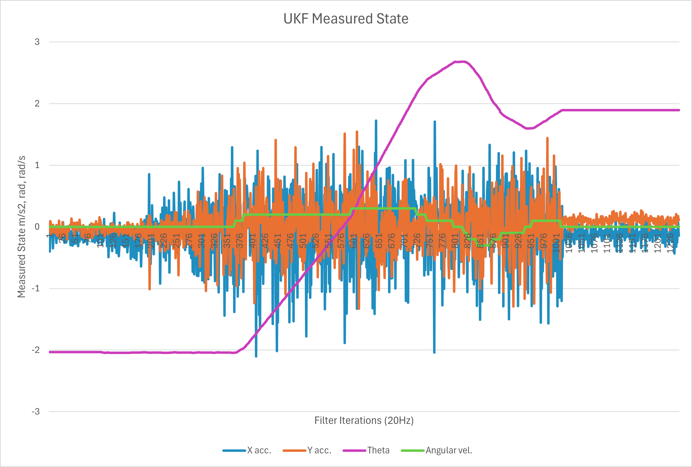

## Tuning

The main value tuned was R, which was taken from the covariance of the IMU, calculated when the robot was stationary. The values used are shown below. Because this produced a fairly good result, that was not too jagged, Q was not tuned further and was a simple identity matrix.

                        x = 0.016456205661175602
                        y = 0.008577255570198977
                        w = 6.233895533623428e-07
                        xy = 0.004413254587348959
                        xw = 5.035625506559743e-06
                        yw = -4.948621957743115e-06
                R =       [[1,0,0,0,0,0,0,0,0],
                           [0,1,0,0,0,0,0,0,0],
                           [0,0,x,0,0,xy,0,xw,0],
                           [0,0,0,1,0,0,0,0,0],
                           [0,0,0,0,1,0,0,0,0],
                           [0,0,xy,0,0,y,0,yw,0],
                           [0,0,0,0,0,0,1,0,0],
                           [0,0,xw,0,0,yw,0,w,0],
                           [0,0,0,0,0,0,0,0,1]]

## Analysis

### Video
The robot, and the tracks generated by the KF and EKF are shown below, modeled in rviz.

 

If the video does not load correctly, it is in the images folder.

As can be seen, the EKF and KF results are quite good. However, the UKF, shown in blue is not visible. This is because the UKF models the robot as being several thousand meters from its actual location. This is likely caused by a bug in the code, and is not accurate.

### Residual
The residuals between the measurements and estimated states are shown below, with 3 sigma error bars.

The residual for the Kalman filter is shown below:
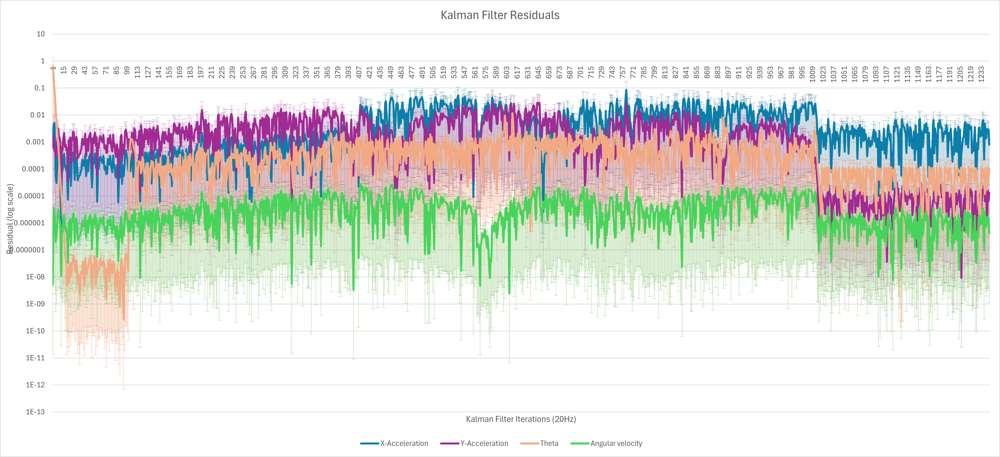

For most of the run, the residual is quite small, validating the performance of the filter. Note that the angular measurements are generally better than the linear ones. This is likely due to the high level of noise from the IMU, and the fact that angular data is based both on both the IMU and the wheel encoders.

The residual for the EKF is shown below:
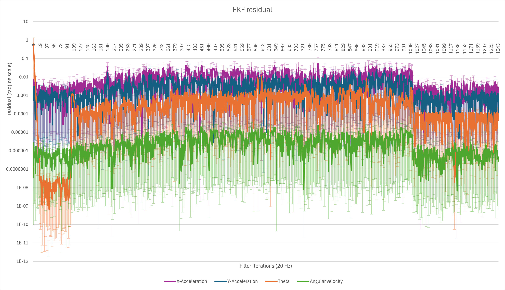

The overall trend is much the same as the KF, albeit generally lower, showing then performance increase between the EKF and KF.

The residual for the UKF is shown below:
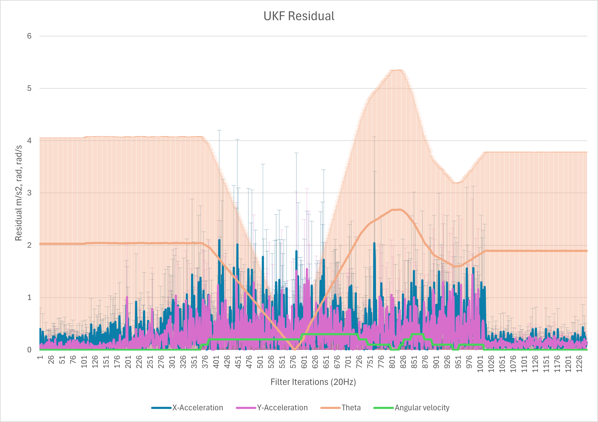

This is significantly worse, again implying that this implementation of tis filter does not work correctly.

### Residual Comparison

The residual for the Kalman filter is shown below:

The residual for the untuned Kalman filter is shown below:
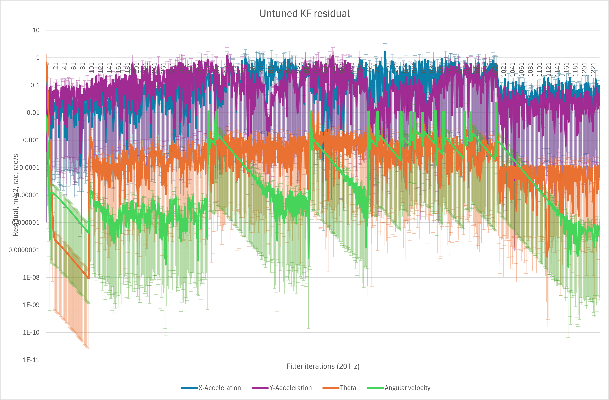

The untuned KF simply uses an identity matrix in place of the tuned R. While it does occasionally perform better, the X and Y accelerations in particular are significantly worse. This shows how correctly modeling IMU noise can improve the performance of the filter.

### Covariance

The diagonal covariance for the Kalman filter is shown below:
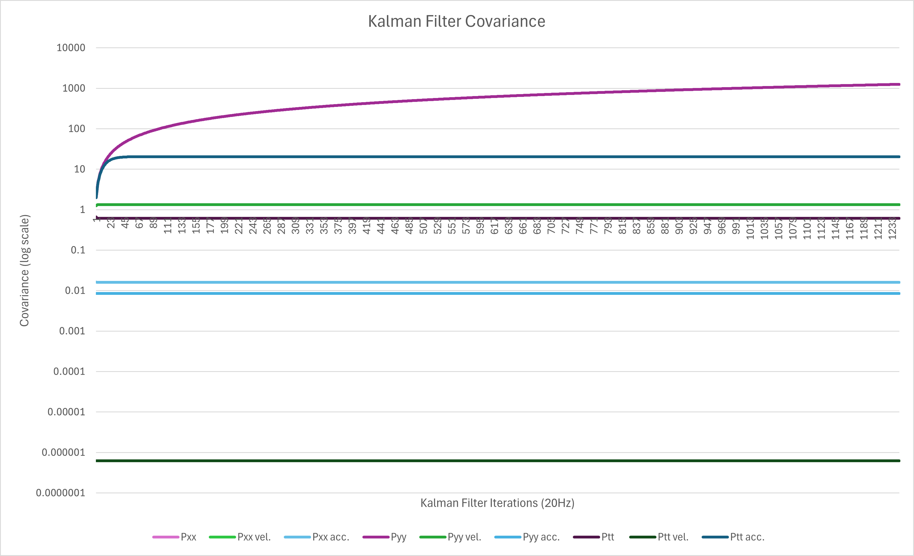
While it seems mostly stable, the constant growth in Pyy is concerning.

The diagonal covariance for the EKF is shown below:
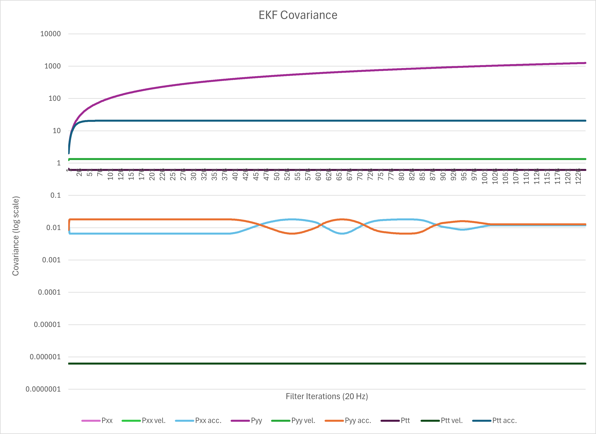
While it seems mostly stable, the constant growth in Pyy and the angular acceleration is concerning.

The diagonal covariance for the UKF is shown below:
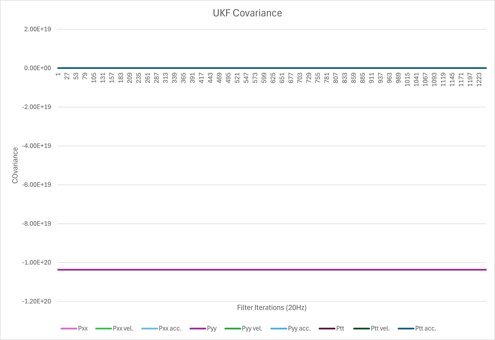
Again, the filter is not performing correctly.

### Ground truth

The ground truth error can be calculated by subtracting the final value from the initial value after driving in a circle.

KF

0.455029721041878	-0.0156309598830225	-0.575247049870697	-0.31161293118906	-0.00723482718051702	-0.306910307956186	-3.24811623237298	1.96171557093787E-06	0.000677521833278451

EKF

0.512933207671685	0.00194768852111131	-0.33154816654963	-0.277072407650756	0.0081365940737539	0.143802544812145	-3.24811614446372	2.00799887346471E-07	0.00067617120290947

UKF

0	4.41673106902026E-16	8.8334621380405E-15	0	2.73005804675164E-16	5.46011609350327E-15	0	0	2.51449413539198E-30

The UKF data can be largely ignored, for reasons already mentioned. Overall the EKF performs better, much of the error is a result of the robot not perfectly returning to the initial position

## Decision:
Based on all the data, the EKF is the best choice. It demonstrated the best overall residual, and the best subjective assessment from RVIZ traces. This makes sense, as te EKF is specifically designed as an extension of the KF for nonlinear systems, and the system has non-linear dynamics.

## Improvement
Unfortunately, this code was not as well optimized or debugged as it should have been due to time constraints. With additional time, the values of Q could be tuned and the values of R improved. Additionally, B and F are balanced equally by 0.5, which may not be optimal. 

The UKF is theoretically a good approach for a system like this. With additional development time to fix and tune it, it might be able to improve the performance of the filter overall.